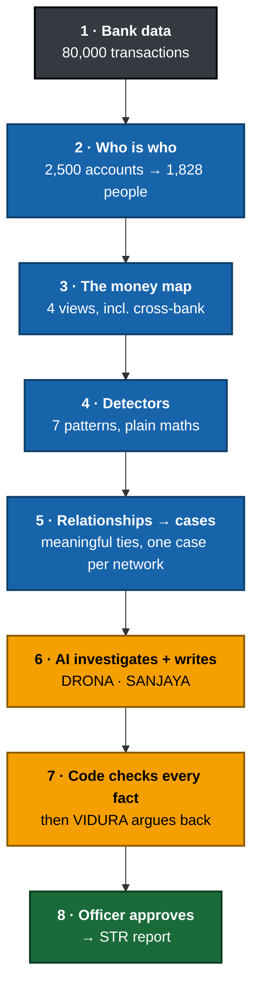
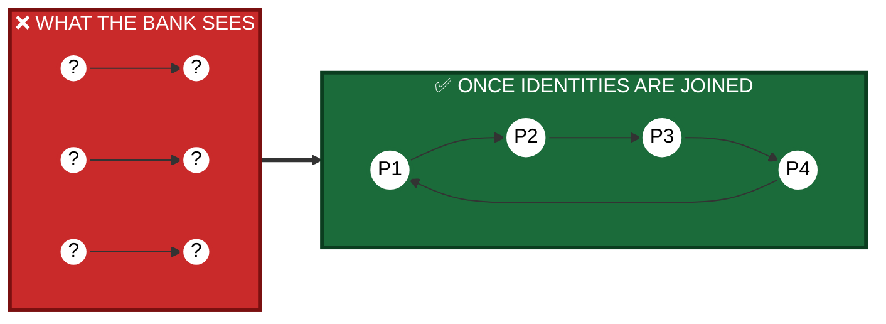
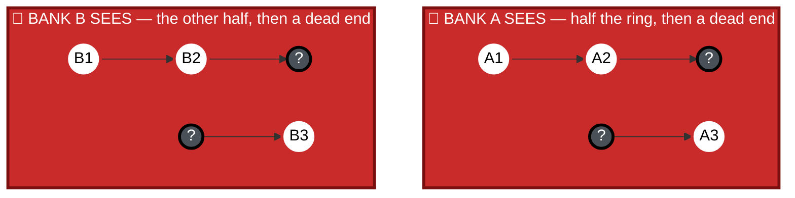
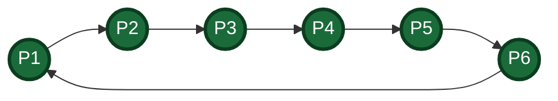
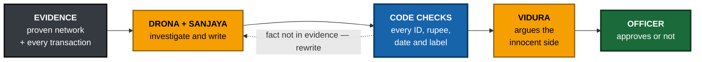
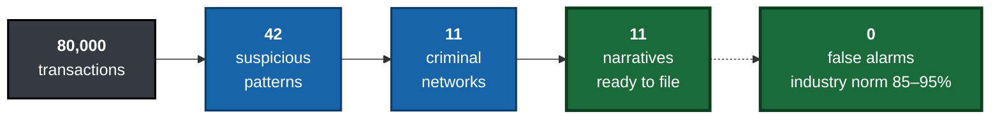
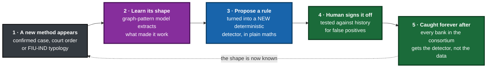

# CHAKRAVYUH · चक्रव्यूह

## An Indian bank froze someone's entire account over a disputed **₹100**.<br/>The criminals who moved **₹17,000 crore** through accounts like it were never found.

**Both failures have the same cause.** Banks look at transactions one at a time. Laundering is not a transaction — it is a *shape* made of hundreds of innocent-looking ones. So the software misses the network and punishes whoever it can see.

> # CHAKRAVYUH scores the network, not the transaction.
> **It finds the ring, proves it with the bank's own records, and hands the officer a finished, fact-checked case — instead of an alert.**

| 11 of 12 | 0 | 2.73 vs 0.4 | 246 / 246 | 0 |
|:---:|:---:|:---:|:---:|:---:|
| hidden laundering rings caught | **false positives** | meaningful relationships found per case vs random groups | AI facts verified against raw data | API calls needed for the demo |

[**▶ Live demo**](https://chakravyuh-bnkiuzjcv44pm79vn7jaxr.streamlit.app/) · [**▶ Demo video**](https://drive.google.com/file/d/1DcThqp_D1bDghtR9tl4Vzy596FecWCZb/view?usp=sharing) · [Technical docs](docs/TECHNICAL.md) · [Build log](docs/DEVELOPMENT_LOG.md) · [Evidence pack](docs/EVIDENCE_PACK.md)

IGNITRRON'26 · Problem Statement **FC-02** · Team **Tech Coders (T-300)**

---

# 🎯 The key challenge

> ## *"Discover meaningful relationships within transaction networks and convert them into an understandable investigation narrative."*
>
> — Problem Statement **FC-02**

**Two halves. Almost every product on the market solves neither.**

| The challenge | Why it is genuinely hard | How CHAKRAVYUH answers it | Proof |
|---|---|---|---|
| **1 · Discover meaningful relationships** | Banks store *accounts*, not *people*. The same person appears 3–4 times, spelled differently. Half the network sits at another bank. And two accounts that merely transacted is **not** a meaningful relationship — it is noise | Resolve **identity first**, then build the graph, then score every tie **against the bank's own baseline** — [§5.1](#-novelty-1--we-work-out-who-people-really-are-before-looking-for-crime), [§5.2](#-novelty-2--two-banks-catch-a-shared-gang-without-sharing-any-customer-data) | **2.73** signals per case vs **0.4** random |
| **2 · Convert it into an understandable narrative** | A graph is not a case. An officer needs a story with names, amounts, dates and a legal basis — and one number invented by a language model destroys the filing | The evidence exists **before** the AI speaks, the AI only explains it, and **code checks every fact** before a human reads it — [§5.3](#-novelty-3--the-ai-is-not-trusted-it-is-checked-by-arithmetic) | **246/246** facts verified |

| Jump to | |
|---|---|
| The problem, and who it hurts | [§1](#1--the-problem) · [§2](#2--who-it-hurts-and-how-much) |
| Why every existing solution fails | [§3](#3--why-todays-solutions-fail) |
| **How we remove each failure** | [**§3.1**](#31--how-chakravyuh-removes-each-failure) |
| What we built | [§4](#4--our-solution) |
| What is genuinely new | [§5](#5--what-makes-ours-different) |
| Proof it works | [§6](#6--does-it-work) |
| Could a real bank use it | [§7](#7--could-a-real-bank-use-it) |
| Where it goes next — **self-learning detection** | [§8](#8--future-scope--a-system-that-learns-every-new-trick-once) |

---

## 1 · The problem

A criminal never moves dirty money in one big suspicious transfer.

They split it into **many small, boring, perfectly legal-looking transfers**, pass it through accounts belonging to other people, and bring it back clean.

Bank software checks **each transfer on its own** — so each one passes.

> ### The crime is not in any transaction.<br/>The crime is the shape they make together.
> **Nobody's software looks at the shape.**

---

## 2 · Who it hurts, and how much

| Who | What it costs them |
|---|---|
| **Society** | **$800bn – $2tn** laundered every year — 2–5% of global GDP. Authorities catch **under 1%** |
| **Banks** | **$206bn a year** spent trying. **85–95%** of alerts are false alarms. **$25–$50** to investigate each one |
| **Investigators** | Buried in noise. Only **1–5%** of alerts ever become a real report |
| **Innocent customers** | Whole accounts frozen over disputed amounts **as low as ₹100** |
| **Small banks** | India's **1,843 co-operative banks** carry the same legal duty as SBI, with none of the budget |

### 🇮🇳 India: what it costs when you cannot see the network

Because banks cannot identify the *network*, India's response has been to freeze *accounts* — in bulk.

| | |
|:---|---:|
| Mule accounts frozen by **I4C** in a single year | **~4.5 lakh** |
| Siphoned through them in that year | **₹17,000 crore** |
| Frozen-account petitions the **Rajasthan High Court** disposed of in one August 2026 judgment | **105** |
| Lowest disputed transaction found — with the **entire account** still frozen | **₹100** |

The High Court found petitioners who were **neither accused nor suspects**, and some **exonerated after investigation whose accounts stayed frozen anyway.** It held that labels like *"suspicious transaction"* or *"mule account"* justify investigation — **not blanket immobilisation.**

**Then, on 11 September 2026 — eight days before this hackathon — the RBI issued a draft direction** capping a temporary debit hold at **60 days** and ordering that account-level holds be used **"as a last resort and only in exceptional circumstances."**

> ### The regulator and the courts intervened *this month* because the tooling cannot tell a criminal network from a student's account.
> **That is the gap FC-02 asks us to close.**

### 🇮🇳 The regulator has already said the reporting is failing

The **FATF Mutual Evaluation of India (September 2024)** rated India's *Supervision* and *Preventive Measures* only **Moderate**, and found:

> *"Suspicious transaction reporting by some FI sub-sectors appears low"* — naming **rural banks and non-banking companies**.

### 🌍 Not an India-only failure — TD Bank, October 2024

TD Bank failed to monitor **92% of its transaction volume — $18.3 trillion** — while three criminal networks moved **$670 million** through it. Its rules had barely changed since 2014.

**Penalty: $3.09 billion.** The largest ever under the US Bank Secrecy Act.

> They were not short of alerts. **They could not connect them.**

---

## 3 · Why today's solutions fail

| What is used today | Why it fails |
|---|---|
| 🇮🇳 **Freeze the account** — India's bulk mule crackdown | Catches the mule, never the network behind it. **~4.5 lakh accounts frozen in a year.** Entire accounts locked over **₹100**, people **neither accused nor suspects**, some **exonerated and still frozen** — until the courts and the RBI stepped in during 2026 |
| **Rule engines** — *"flag anything over ₹10 lakh"* | Criminals simply stay under the line. **85–95% false alarms.** TD Bank's rules were 10 years stale when it was fined **$3.09bn** |
| **Machine-learning risk scoring** | Laundering is **0.1–2%** of any dataset, and the "right answers" are really analyst opinions. A regulator cannot accept *"the model felt it was suspicious"* |
| **Manual investigation** | An analyst genuinely can follow a money trail — at **hours per case**, for a handful of cases a week. It does not scale to 80,000 transactions |
| 🌍 **Pooling data across banks** — Netherlands, TMNL | It **worked**, and the FATF praised it. **Shut down in January 2025** after a human-rights challenge for **15,000 customers**. It required collecting innocent people's data in one place |
| **Generative AI writing the report** | It invents facts. Inside a legal filing, one invented number destroys the case — so a human must re-check everything, which puts back the work the tool was meant to remove |

> **The gap:** every approach either drowns the bank in noise, punishes innocent people instead of finding the network, cannot explain itself to a regulator, stops at the bank's own wall, or cannot be trusted to write the truth.
>
> ### Not one of them discovers meaningful relationships and turns them into a narrative.

---

### 3.1 · How CHAKRAVYUH removes each failure

| The failure | How we remove it | Evidence |
|---|---|---|
| 🇮🇳 **Innocent accounts frozen** | We hand the officer **the network and the exact transactions**, so the bank can act on the ring instead of locking whoever it can see. An account with no suspicious network around it **never becomes a case** — and we built precision-first, refusing a link rather than accusing a person | **0 false positives** on 80,000 transactions · **0 false merges** on 2,500 accounts |
| **85–95% false alarms** | We do not alert on single transactions at all. A case needs **multiple independent signals on one network** — a circle *plus* speed *plus* threshold-hugging amounts | 80,000 → 42 findings → **11 cases** |
| **Cannot explain itself to a regulator** | Detection is **deterministic graph mathematics** — no model, no training, no labelled data. Every finding is reproducible and every arrow keeps its transaction IDs | Every case traceable to raw rows |
| **Stops at the bank's own wall** | A consortium view that exchanges **one-way scrambled codes only** — no names, no PANs, no addresses, nothing to leak | Ring invisible to each bank, **visible together** |
| **AI invents facts** | **Code** checks every ID, rupee figure, date and label against raw data before any human reads it. The AI is not even allowed to write numbers | **246/246 verified** · 11/11 passed |
| **Small banks cannot afford it** | Runs on a laptop. No GPU, no training data, no licence | Demo makes **0 API calls** |

---

## 4 · Our solution

**Build a map of the money. Find the shapes criminals make. Hand over a finished, fact-checked case.**



**Blue = plain computer logic · Amber = AI · Green = a human being**
**Stages 2–5 discover the relationships. Stages 6–7 turn them into the narrative.**

> 🔒 ### The rule behind the whole design: AI never decides. AI only explains.

A regulator cannot accept *"the model felt it was suspicious."* They can accept *"these six transfers form a closed loop, here they are."*

**The evidence exists before the AI ever speaks.**

### The seven detectors are the regulator's own indicators

We did not invent these patterns. They are what India's regulator tells banks to watch for.

| Detector | What it hunts | The official rule it implements |
|---|---|---|
| 🔄 **CIRCLE** | Money that leaves and comes back | RBI: *"complex transactions with no apparent economic rationale"* |
| 🕸️ **SPRAY** | One account feeding 25 others, or 25 feeding one | FIU-IND: mule-account fan-out over UPI |
| ⚡ **SPEED** | Money leaving minutes after arriving | RBI: *"turnover inconsistent with the balance maintained"* |
| 📏 **THRESHOLD** | Transfers sitting just under the reporting limit | Structuring below the ₹10,00,000 PMLA limit |

Plus three more: dormant reactivation, pass-through behaviour, round-amount clustering.

**Why seven and not one:** a single signal is weak. A circle might be innocent. A circle *plus* speed *plus* amounts hugging the legal threshold is not.

### Three AI agents, named for the Mahabharata

| Agent | Role |
|---|---|
| **DRONA** | Lead investigator. Triages, chooses its own read-only evidence tools, recommends a decision |
| **SANJAYA** | Writes the case in plain English |
| **VIDURA** | Argues the innocent side before anything passes |

---

## 5 · What makes ours different

### 🥇 Novelty 1 — We work out who people really are *before* looking for crime

> **Challenge half 1:** a relationship between two *account numbers* is not meaningful. A relationship between two *people* is.

The same person sits in a bank's records three or four times, spelled differently, with pieces missing:

```
 SYSTEM               NAME ON RECORD    PHONE         PAN           ACCOUNT
 ───────────────────────────────────────────────────────────────────────────
 CORPORATE BANKING    ANNA DESAI        7705029423    FNZVH4843G    ACC00003
 RETAIL BANKING       Anna Deasi   ←    7705029423    FNZVH4843G    ACC00004
 WATCHLIST            Anna Deasi   ←    7705029423    FNZVH4843G    ACC00003
                          ↑
                    spelled wrong
```

Until those records are joined, **the map is wrong** — and the circle between them is invisible.



**Six strangers become one closed circle.** In our data, 47 ring accounts belong to only **19 real people**.

It is **precision-first** — we would rather miss a link than accuse an innocent person. Blocking rules beat matching rules: two different PANs can never be one person; a shared address with different PANs is a family, not an individual.

> **Better because:** every other system searches a map that is already wrong.
> **2,500 accounts → 1,828 people, zero false merges.**

---

### 🥇 Novelty 2 — Two banks catch a shared gang without sharing any customer data

> **Challenge half 1 again:** half of any real network sits at a bank that cannot see it. This is the failure that killed the Dutch consortium — we solved it by never pooling data at all.



Anyone at the other bank is an unreadable **?**, and a bank cannot even tell that two of those unknowns are the same person. One hop happens entirely inside each bank, so **neither can ever close the loop alone.**

Now the same six accounts through the consortium — **scrambled codes only.** The loop closes:



| ✅ What crosses | ❌ What never crosses |
|---|---|
| A one-way scrambled code made from the PAN | Names · readable PANs · addresses |
| Direction of money, in or out | Balances · KYC documents |
| A rough amount band and time band | Account numbers |

The same person at two banks produces the same code — and **neither bank can turn that code back into a name.**

> **Better because:** the only approach that ever solved cross-bank laundering was made **illegal** for collecting innocent people's data. Ours gets the same answer with **nothing to collect.**
> Bank A alone ❌ · Bank B alone ❌ · **Consortium ✅**

---

### 🥇 Novelty 3 — The AI is not trusted. It is checked by arithmetic.

> **Challenge half 2:** the narrative is only worth anything if every word of it is true.

Everyone building AI for compliance faces one objection: *what if it invents something, inside a legal document?* The usual answer — "a human reviews it" — puts back the work the tool was meant to remove.



**Step 3 is not an AI checking an AI. It is code checking arithmetic.**

This caught real mistakes during our build. The AI wrote **₹140 crore** where the true figure was **₹14 crore**. It labelled a mule case as *"structured transactions."* **Both were blocked before any human saw them.**

Then we fixed the cause: **the AI is no longer allowed to write numbers at all.** Code formats every amount into finished text and the model may only copy it.

VIDURA judges by the **correct legal standard** — *reasonable suspicion*, not proof of guilt. A compliance officer never has proof of criminal intent when they file; demanding it would block every genuine report.

> **Better because:** nobody else can say the AI's narrative was checked **without a human.**
> **246 of 246 facts verified. 11 of 11 cases passed.**

---

## 6 · Does it work?



| Stage | Result |
|---|---|
| **Identity** | 2,500 accounts → 1,828 people, **zero false merges** |
| **Detection** | 42 findings → 11 cases · **11 of 12 hidden rings** · **0 false positives** |
| **Cross-bank** | Hero ring — ₹2.4 crore, 6 accounts, 3 hours — invisible to each bank alone, **visible in the consortium** |
| **🎯 Meaningful relationships** | **2.73** signals per case vs **0.4** for random groups, measured on 220 random customer groups — fresh accounts, one person behind many accounts, first-ever contact, shared phones, bank blind spots |
| **🎯 Understandable narrative** | **11/11 PASS** · **246/246 facts verified** · 9 HIGH, 2 MEDIUM confidence |

**About the one we missed:** we did not find `CIRC_5_SUBTLE`, the ring we deliberately made hardest. **We report 11 of 12 rather than tuning our settings until we reached 12.** A system that scores perfectly on data it generated itself is not one a bank should trust — and **zero false alarms matters more than a perfect catch rate**, because every false alarm is an innocent person locked out of their own money.

---

## 7 · Could a real bank use it?

### Built against India's actual rules

| What the law requires | How CHAKRAVYUH meets it |
|---|---|
| RBI: *"deploy robust software that throws up alerts"* | Seven detectors plus lowered-threshold monitoring of known risk |
| RBI: risk-based monitoring | Two lanes — normal thresholds for everyone, lowered for known high-risk |
| PMLA: file an STR **within 7 working days** | A drafted, evidence-linked case in **under a minute** |
| PMLA: *"unusual or unjustified complexity"*, *"no economic rationale"* | The exact wording the system writes — the legal test, applied |
| **RBI draft, Sept 2026: freezes must be proportionate, a last resort** | We name the **network and the specific transactions**, so a bank acts on the ring instead of freezing a student |
| Reports must be evidence-backed and traceable | Every arrow keeps its transaction IDs |
| A named officer is accountable | **Nothing is filed without a human pressing approve** |
| Must withstand a regulator's audit | Detection is deterministic — every finding reproducible |
| Limits on sharing customer data | The consortium exchanges scrambled codes only |

### Who would buy it

A transaction monitoring platform costs **$100,000–$500,000 a year** before anyone is hired to run it. India's **1,843 co-operative banks** will never pay that — which is exactly why the FATF found their reporting low.

**CHAKRAVYUH runs on a laptop.** No training data, no labelled examples, no GPU. The live demo makes **zero API calls** because results are computed once and cached.

### What production would need

Honest answer: **data integration and scale testing, not a different approach.** A bank points it at its core banking export and KYC records — the same CSV shapes we already consume. Detection, case builder and agents are unchanged. What is left is connectors, throughput, and a supervised tuning period against that bank's own history.

---

## 8 · Future scope — a system that learns every new trick, once

Criminals change method the moment a method stops working. Today every bank re-learns each new trick the slow way: a fraud happens, an analyst notices months later, a committee writes a rule, IT ships it next quarter. **TD Bank's rules went ten years without a meaningful change.**

**Our next build closes that loop — without giving up the thing that makes us defensible.**



| Stage | What happens |
|---|---|
| **Learn** | A graph-pattern model trains on confirmed cases — including the ones we lose — and extracts the *structural signature* of the new method: the shape, the timing, the amount behaviour |
| **Translate** | The learned signature is compiled into a **new deterministic detector**, not a black-box score. The maths stays readable |
| **Verify** | Replayed over historical data. If it raises innocent customers, it never ships. Precision-first, exactly like our entity matcher |
| **Distribute** | The detector travels across the consortium. **The banks share the lesson, never the customers** — same privacy guarantee as today |
| **Close the loop** | The method that worked once is structurally impossible to repeat undetected |

> ### Why this is not the ML we rejected in §3
> A black-box model that *scores* a customer cannot be defended to a regulator, and trains on analyst opinions.
> **Ours learns the pattern and then writes a rule a human can read, test and sign.** The learning is offline; the detection stays deterministic; the audit trail survives.
>
> `CIRC_5_SUBTLE` — the one ring we missed — is exactly the first thing this layer would be fed.

**Also on the roadmap:** live core-banking connectors · more than two banks in the consortium · cross-border and multi-currency flows · analyst feedback as a training signal · a regulator-facing audit console.

---

## 9 · Run it

```bash
git clone https://github.com/akarshncodes/chakravyuh.git && cd chakravyuh
pip install -r requirements.txt
streamlit run app.py        # uses committed results — no API key needed
```

**Try this in the app:** Dashboard → **Case File** *(rotatable 3D money trail)* → **AI War Room** → **C001** → **▶ Replay investigation** → **Cross-Bank View** → Bank A / Bank B / Consortium → **Case Queue** → **Approve** → download the STR report.

| File | What it does |
|---|---|
| `generate_data.py` | 1 · Synthetic bank data, 12 hidden rings (seed 26192) |
| `entity_resolution.py` | 2 · Scattered records → real people, precision first |
| `graph_builder.py` | 3 · Money graph in 4 views |
| `detectors.py` | 4 · Seven deterministic detectors |
| `case_builder.py` · `relationships.py` | 5 · Findings → cases, plus the **Relationship Lens** |
| `orchestrator.py` | DRONA — AI lead investigator with read-only tools |
| `agents.py` | 6–7 · SANJAYA (writer) and VIDURA (fact-check + sceptic) |
| `app.py` · `str_report.py` | 8 · Dashboard and printable STR draft |

Each stage reads the previous stage's files and writes its own, so any stage can be re-run and checked alone.

**Stack:** Python · NetworkX · pandas · Streamlit · Plotly · OpenAI API · Streamlit Community Cloud

---

## Limits we own

We would rather tell you than have you find it.

| Limitation | Honest detail |
|---|---|
| One ring undetected | `CIRC_5_SUBTLE`, deliberately the hardest. Not tuned around |
| Lane labelling | Cases are tagged by *who* appears in them rather than *which threshold* found them. The detection is right; the label is not |
| Hero ring joins to 4 people, not 3 | Two records share only a name. The matcher correctly refused — precision held, a link was lost |
| Synthetic data | Unavoidable at a hackathon. Going live needs integration and scale testing |
| Two banks | The consortium design extends to any number; we demonstrate two |

---

## Team Tech Coders (T-300)

| | Role |
|---|---|
| **Akarsh N** *(lead)* | Problem research, system architecture, AI agent design, product and pitch |
| **Rohit S** | Testing and verification, domain research, demo and presentation |

---

## Sources

Every figure above can be checked.

**India**
- [Rajasthan High Court guidelines on freezing bank accounts in cyber-fraud cases, August 2026 — SCC Online](https://www.scconline.com/blog/post/2026/09/18/rajasthan-hc-bank-account-freeze-cyber-fraud-guidelines/)
- [RBI draft direction capping cyber-fraud account holds at 60 days, 11 September 2026 — MediaNama](https://www.medianama.com/2026/09/223-rbi-cyber-fraud-account-freeze-rules/)
- [Centre freezes ~4.5 lakh mule bank accounts — Business Standard](https://www.business-standard.com/india-news/centre-freezes-450-000-mule-bank-accounts-used-in-cyber-fraud-schemes-124111200320_1.html)
- [FATF — Mutual Evaluation of India, September 2024](https://www.fatf-gafi.org/en/publications/Mutualevaluations/India-MER-2024.html)
- [FIU-IND — STR and CTR reporting obligations](https://fiuindia.gov.in/files/FAQs/faqs.html)
- [RBI — Master Circular on KYC norms and AML standards](https://rbidocs.rbi.org.in/rdocs/content/pdfs/45ML010712F_A.pdf)
- [PIB — Cooperative Banks in India, August 2025](https://www.pib.gov.in/PressReleasePage.aspx?PRID=2157875&reg=3&lang=2)

**International**
- [US DOJ — TD Bank guilty plea, October 2024](https://www.justice.gov/archives/opa/pr/td-bank-pleads-guilty-bank-secrecy-act-and-money-laundering-conspiracy-violations-18b)
- [Transaction Monitoring Netherlands — what went wrong](https://zquas.ai/tmnl.html)
- [AML compliance costs for mid-size banks, 2026](https://fraxtional.co/feeds/blog/aml-compliance-systems-cost-mid-size-banks)
- [Money laundering statistics 2026 — KYC Hub](https://www.kychub.com/blog/money-laundering-statistics)

---

*Synthetic data only. Prototype, not an official bank or government system. Nothing is ever filed automatically.*

# We score networks, not transactions.
