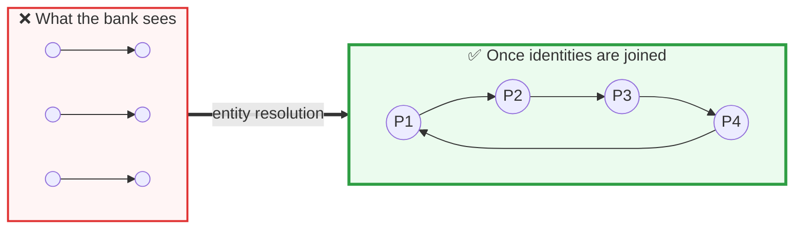
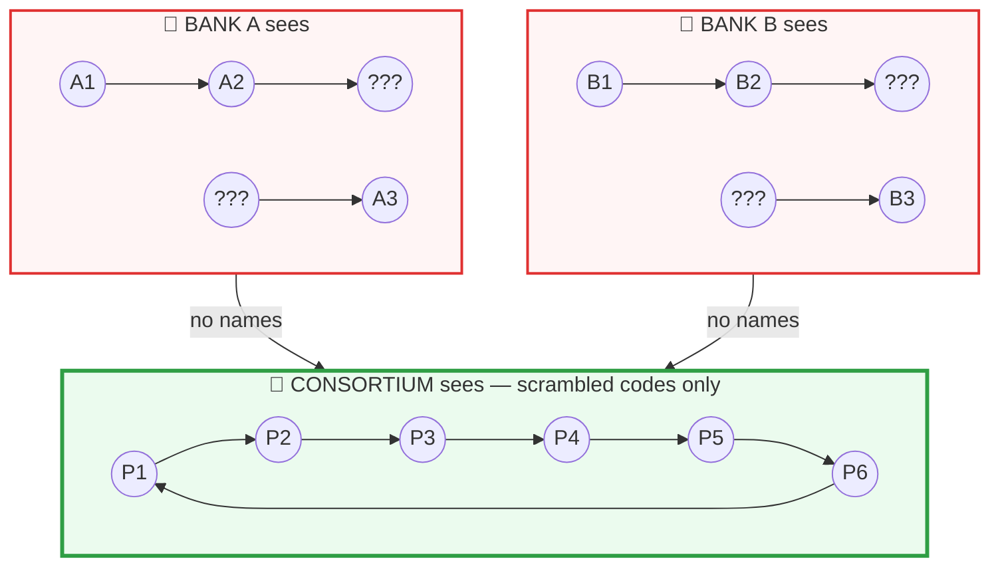
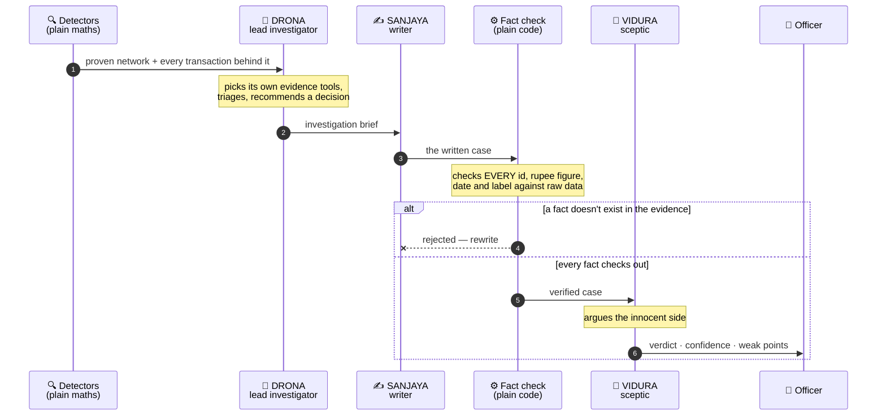
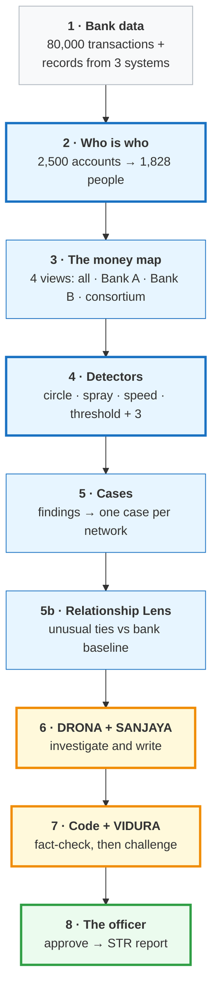
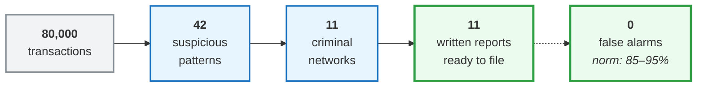

# CHAKRAVYUH · चक्रव्यूह

**AI-powered anti-money-laundering investigation system** · IGNITRRON'26 · Problem Statement **FC-02** · Team **Tech Coders (7-300)**

[**▶ Live demo**](https://chakravyuh-bnkiuzjcv44pm79vn7jaxr.streamlit.app/) · [**▶ Demo video**](https://drive.google.com/file/d/1DcThqp_D1bDghtR9tl4Vzy596FecWCZb/view?usp=sharing) · [Full technical docs](docs/TECHNICAL.md) · [Development log](docs/DEVELOPMENT_LOG.md)

> Banks check one transaction at a time, so a laundering ring made of normal-looking transfers stays invisible. **CHAKRAVYUH scores the network, not the transaction**, and hands the officer a finished, fact-checked case instead of an alert.

| 11 of 12 | 0 | 246 / 246 | 11 / 11 | 0 |
|:---:|:---:|:---:|:---:|:---:|
| hidden laundering rings caught | false-positive cases | AI-written facts verified against raw data | reports passed independent review | live API calls needed for the demo |

---

## 60-second guide for judges

| Criterion | In one line | Look here |
|---|---|---|
| **Problem Relevance & Understanding** | Under 1% of the $2 trillion laundered each year is caught; the FATF's 2024 evaluation of India names rural banks and NBFCs as under-reporting | [§1](#1--the-problem-and-why-it-matters) |
| **Innovation / Novelty** | Identity resolved before the graph · cross-bank detection with no data shared · AI checked by code, not by another AI | [§2](#2--what-makes-this-different) |
| **Technical Approach** | Deterministic graph detection finds and proves the pattern; three AI agents investigate and write; code checks the AI | [§3](#3--technical-approach) |
| **Prototype Functionality** | 80,000 transactions → 42 findings → 11 cases → 11 filed reports, zero false alarms. Deployed and running | [§4](#4--does-it-work) |
| **Practical Applicability / Feasibility** | Built against RBI and PMLA rules, for the 1,843 co-operative banks that can never afford a ₹1 crore monitoring platform | [§5](#5--could-a-real-bank-use-this) |

---

## 1 · The problem, and why it matters

A criminal never moves dirty money in one big suspicious transfer. They split it into many small, boring, perfectly legal-looking transfers.

Bank software checks each transfer on its own — so each one passes. **The crime only becomes visible when you look at all of them together, and nobody's software does that.**

| The result | |
|---|---|
| Laundered worldwide every year | **2–5% of global GDP** — $800bn to $2tn |
| How much authorities actually catch | **under 1%** |
| What banks spend trying | **$206 billion a year** |
| Alerts that turn out to be false alarms | **85–95%** |
| Alerts that become a real report | **1–5%** |
| Cost to investigate a single alert | **$25–$50** |

### TD Bank, October 2024

Failed to monitor **92% of its transaction volume** — **$18.3 trillion** — while three criminal networks moved **$670 million** through it. Its detection rules had barely changed since 2014. Penalty: **$3.09 billion**, the largest ever under the Bank Secrecy Act.

**They were not short of alerts. They could not connect them.**

### And in India, right now

The **FATF's Mutual Evaluation of India (September 2024)** rated India's *Supervision* and *Preventive Measures* only **Moderate**, and found:

> *"Suspicious transaction reporting by some FI sub-sectors appears low"* — naming **rural banks and non-banking companies**.

India has **1,843 co-operative banks** under RBI and NABARD supervision. Every one carries the same legal duty as SBI: file a Suspicious Transaction Report **within 7 working days** of forming suspicion.

Meanwhile roughly **8.5 lakh accounts** have been frozen in the current mule-account crackdown — and the blunt approach also catches students and small traders who did nothing wrong.

**Too much noise for the big banks. No tool at all for the small ones. And innocent people paying the price for both.**

---

## 2 · What makes this different

### 2.1 We work out who people really are — *before* looking for crime

The same person sits in a bank's records three or four times, spelled differently each time, with pieces missing:

```
 SYSTEM               NAME ON RECORD    PHONE         PAN           ACCOUNT
 ───────────────────────────────────────────────────────────────────────────
 CORPORATE BANKING    ANNA DESAI        7705029423    FNZVH4843G    ACC00003
 RETAIL BANKING       Anna Deasi   ←    7705029423    FNZVH4843G    ACC00004
 CORPORATE BANKING    Anna Desai        (missing)     FNZVH4843G    ACC00003
 WATCHLIST            Anna Deasi   ←    7705029423    FNZVH4843G    ACC00003
                          ↑
                    spelled wrong
```

Until those records are joined, the map is wrong. Six accounts that look like six strangers may be three people — and the circle between them is invisible.



**Six disconnected fragments become one closed circle.** In our data, 47 accounts used by the rings belong to only 19 real people.

**We would rather miss a link than accuse an innocent person.** A wrong merge attaches a real customer to someone else's crime. So the matcher is precision-first, with blocking rules that beat every matching rule: two different PANs can never be one person, and a shared address with different PANs is a *family*, not an individual.

**Result: 2,500 accounts → 1,828 people, with zero false merges.**

### 2.2 Two banks catch a shared gang — without sharing any customer data

Five Dutch banks built exactly this in 2020. They pooled their transaction data, staffed it with 70 people, and **it worked** — the FATF praised it.

**It was shut down in January 2025** after a human-rights group petitioned on behalf of 15,000 customers and the Dutch data protection authority questioned its legal basis.

> **The only approach that demonstrably solved cross-bank laundering was made illegal — because it required collecting innocent people's data in one place.**



Each bank sees only its own customers. Anyone at the other bank is an unreadable **???** — and a bank cannot even tell that two of those unknowns are the same person. One hop of the ring happens entirely inside each bank, so **neither can ever close the loop alone.**

| | Can it see the ₹2.4 crore ring? |
|---|:---:|
| Bank A alone | ❌ No |
| Bank B alone | ❌ No |
| **Both, through the consortium** | ✅ **Yes** |

| ✅ What crosses | ❌ What never crosses |
|---|---|
| A one-way scrambled code made from the PAN | Names · readable PANs · addresses |
| Direction of money, in or out | Account balances · KYC documents |
| A rough amount band and time band | Account numbers |

The same person at two banks produces the same code, and **neither bank can turn that code back into a name.**

### 2.3 The AI is not trusted — it is checked by arithmetic

Every team building AI for compliance faces one objection: **what if it invents something, inside a legal document?** The usual answer — "a human reviews it" — puts back the work the tool was meant to remove.



**Step 4 is not an AI checking an AI. It is code checking arithmetic.** Every ID, rupee figure, date and laundering label the AI writes must match the raw data, or the case is rejected.

> **This caught real mistakes during the build.** The AI wrote **₹140 crore** where the true figure was ₹14 crore. It labelled a mule case as "structured transactions." Both were blocked before any human saw them.
>
> We then fixed the cause: **the AI is no longer allowed to write numbers at all.** Code formats every amount into finished text and the AI may only copy it.
>
> **Current run: 246 of 246 facts verified.**

VIDURA judges by the correct legal standard — **reasonable suspicion, not proof of guilt.** A compliance officer never has proof of criminal intent when they file; demanding it would block every genuine report.

---

## 3 · Technical approach

### The pipeline



**Blue = plain computer logic. Yellow = AI. Green = a human being.**

> ### 🔒 The rule behind the whole design: AI never decides. AI only explains.
>
> The detectors are graph mathematics — exact, repeatable, traceable. A regulator cannot accept *"the model felt it was suspicious."* They can accept *"these six transfers form a closed loop, here they are."*
>
> **The evidence exists before the AI speaks.**

### Three AI agents, named for the Mahabharata

| Agent | Model | Role |
|---|---|---|
| **DRONA** | gpt-4o | Lead investigator. Triages, chooses its own read-only evidence tools, briefs the writer, recommends a decision. *13 items, 100 tool calls it chose: 11 FILE STR · 2 MONITOR* |
| **SANJAYA** | gpt-4o-mini | Writes the case in plain English |
| **VIDURA** | gpt-4o-mini | Argues the innocent side before anything passes |

### The detectors implement the regulator's own indicators

We did not invent these patterns. They are the indicators India's regulator tells banks to watch for.

| Detector | What it hunts | The official rule it implements |
|---|---|---|
| 🔄 **CIRCLE** | Money that leaves an account and returns | **RBI:** *"large and complex transactions with no apparent economic rationale or legitimate purpose"* |
| 🕸️ **SPRAY** | One account feeding 25 others, or 25 feeding one | **FIU-IND:** mule-account fan-out over UPI |
| ⚡ **SPEED** | Money leaving within minutes of arriving | **RBI:** *"high account turnover inconsistent with the balance maintained"* |
| 📏 **THRESHOLD** | Transfers sitting just below the reporting limit | Structuring below the **₹10,00,000** limit in the PMLA Rules |

Plus three more covering dormant reactivation, pass-through behaviour and round-amount clustering.

**Why several and not one:** a single signal is weak. A circle might be innocent. A circle *plus* speed *plus* amounts hugging the legal threshold is not.

All of them are plain mathematics — **no model, no training, no labelled examples.** That sidesteps the biggest unsolved problem in AI money-laundering research, where criminal transactions are 0.1–2% of any dataset and the "right answers" are really just analyst opinions.

### The files

| File | What it does |
|---|---|
| `generate_data.py` | 1 · Synthetic bank data with 12 hidden rings (seed 26192) |
| `entity_resolution.py` | 2 · Scattered identity records → real people, precision first |
| `graph_builder.py` | 3 · Money graph in 4 views: all, Bank A, Bank B, consortium |
| `detectors.py` | 4 · Deterministic detectors: circle, spray, speed, threshold (+3) |
| `case_builder.py` | 5 · Findings → one case per network |
| `relationships.py` | 5b · Relationship Lens: unusual account ties vs the bank's baseline |
| `orchestrator.py` | DRONA · AI lead investigator with read-only tools and code guardrails |
| `agents.py` | 6–7 · SANJAYA (writer) and VIDURA (fact-check + sceptical review) |
| `app.py` · `str_report.py` | 8 · Dashboard and printable STR draft |
| `*.csv` · `*.json` · `graphs/` | Generated data and cached results, committed so the live app needs no compute |
| `docs/` | Diagrams, technical docs, development log |

Each stage reads the previous stage's files and writes its own, so any stage can be re-run and checked on its own.

---

## 4 · Does it work?



| Stage | Result |
|---|---|
| **Identity** | 2,500 accounts → 1,828 people, **zero false merges** |
| **Detection → cases** | 42 findings → 11 cases · **11 of 12 rings** · **0 false positives** |
| **Cross-bank** | Hero ring (₹2.4 crore, 6 accounts, 3 hours) invisible to each bank alone, visible in the consortium |
| **Relationships** | **2.73** unusual-relationship signals per case vs **0.4** for random customer groups |
| **AI investigation** | **11/11 PASS** · **246/246 facts verified** · confidence 9 HIGH, 2 MEDIUM |

### About the one we missed

We did not find `CIRC_5_SUBTLE` — the ring we deliberately made hardest, moving small amounts slowly over several days.

**We are reporting 11 of 12 rather than tuning our settings until we reached 12.** A system that scores perfectly on data it generated itself is not one a bank should trust — and **zero false alarms matters more than a perfect catch rate**, because every false alarm in the real world is an innocent person locked out of their own money.

---

## 5 · Could a real bank use this?

### Built against India's actual rules

| What the law requires | How CHAKRAVYUH meets it |
|---|---|
| RBI: *"deploy robust software that throws up alerts"* | Seven detectors plus lowered-threshold monitoring of known risk |
| RBI: risk-based monitoring, closer watch on higher risk | Two lanes — normal thresholds for everyone, lowered for known high-risk |
| PMLA: file an STR **within 7 working days** of suspicion | A drafted, evidence-linked case in under a minute |
| PMLA's definition: *"unusual or unjustified complexity"*, *"no economic rationale or bona fide purpose"* | The exact wording the system writes — the legal test, applied |
| Reports must be evidence-backed and traceable | Every arrow keeps its transaction IDs; every claim checked against raw data |
| A named officer is accountable for every filing | Nothing is filed without a human pressing approve |
| Must withstand a regulator's audit | Detection is deterministic — every finding reproducible |
| GDPR-style limits on sharing customer data | The consortium exchanges scrambled codes only |

### Who would buy it

A transaction monitoring platform costs **$100,000–$500,000 a year** before anyone is hired to run it. Total AML programme cost at a mid-size bank runs **$500,000 to $3 million a year**.

India's **1,843 co-operative banks** will never pay that — which is exactly why the FATF found their reporting low.

**CHAKRAVYUH runs on a laptop, needs no training data, no labelled examples, and no GPU.** The live demo makes **zero API calls** because results are computed once and cached.

### What production would actually need

Honest answer: **data integration and scale testing, not a different approach.** A bank would point it at its core banking export and KYC records — the same CSV shapes we already consume. The detection, case builder and agents are unchanged. The real work left is connectors, throughput, and a supervised tuning period against that bank's own history.

---

## 6 · Documentation and how to run

```bash
git clone https://github.com/akarshncodes/chakravyuh.git && cd chakravyuh
pip install -r requirements.txt
streamlit run app.py        # uses the committed results, so no API key is needed
```

**Try this in the app:**
Dashboard *(the whole picture)* → **Case File** *(main suspect, where the money came from and went, rotatable 3D money trail)* → **AI War Room** → pick **C001** → **▶ Replay investigation** → **Cross-Bank View** → Bank A / Bank B / Consortium → **Case Queue** → C001 → **Approve** → download the STR report.

Rebuilding every stage from scratch, the design decisions and the limitations are all in [docs/TECHNICAL.md](docs/TECHNICAL.md). The full build story — including the 11 bugs our own testing caught — is in [docs/DEVELOPMENT_LOG.md](docs/DEVELOPMENT_LOG.md). The regulatory research behind every claim on this page — FATF, RBI and PMLA, with sources — is in [docs/EVIDENCE_PACK.md](docs/EVIDENCE_PACK.md).

**Stack:** Python · NetworkX · pandas · Streamlit · Plotly · OpenAI API (gpt-4o, gpt-4o-mini) · Streamlit Community Cloud

---

## What we would fix next

We would rather tell you than have you find it.

| Limitation | Honest detail |
|---|---|
| One ring undetected | `CIRC_5_SUBTLE`, deliberately the hardest. Not tuned around |
| Lane labelling | Cases are tagged by *who* appears in them rather than *which threshold* found them, so most show as watchlist. The detection is right; the label is not |
| Hero ring joins to 4 people, not 3 | Two records share only a name. The matcher correctly refused — precision held, a link was lost |
| Synthetic data | Unavoidable at a hackathon. Going live needs data integration and scale testing |
| Two banks, one currency | The consortium design extends to any number of banks; we demonstrate two |

---

## Team Tech Coders (7-300)

| | Role |
|---|---|
| **Akarsh N** *(team lead)* | Problem selection and research, system architecture, AI agent design, product and pitch |
| **Rohit S** | Testing and verification, domain research, demo and presentation |

---

## Sources

Every figure above can be checked.

- [FATF — Mutual Evaluation of India, September 2024](https://www.fatf-gafi.org/en/publications/Mutualevaluations/India-MER-2024.html)
- [FIU-IND — STR and CTR reporting obligations](https://fiuindia.gov.in/files/FAQs/faqs.html)
- [RBI — Master Circular on KYC norms and AML standards](https://rbidocs.rbi.org.in/rdocs/content/pdfs/45ML010712F_A.pdf)
- [US Department of Justice — TD Bank guilty plea, October 2024](https://www.justice.gov/archives/opa/pr/td-bank-pleads-guilty-bank-secrecy-act-and-money-laundering-conspiracy-violations-18b)
- [Transaction Monitoring Netherlands — what went wrong](https://zquas.ai/tmnl.html)
- [Press Information Bureau — Cooperative Banks in India, August 2025](https://www.pib.gov.in/PressReleasePage.aspx?PRID=2157875&reg=3&lang=2)
- [AML compliance costs for mid-size banks, 2026](https://fraxtional.co/feeds/blog/aml-compliance-systems-cost-mid-size-banks)
- [Money laundering statistics 2026 — KYC Hub](https://www.kychub.com/blog/money-laundering-statistics)

---

*Synthetic data only. Prototype, not an official bank or government system. Nothing is ever filed automatically.*

**We score networks, not transactions.**
