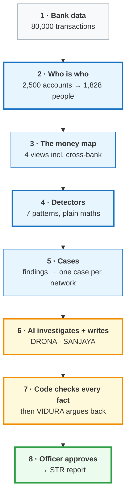
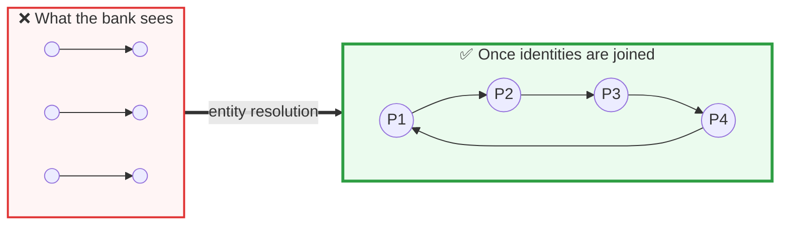
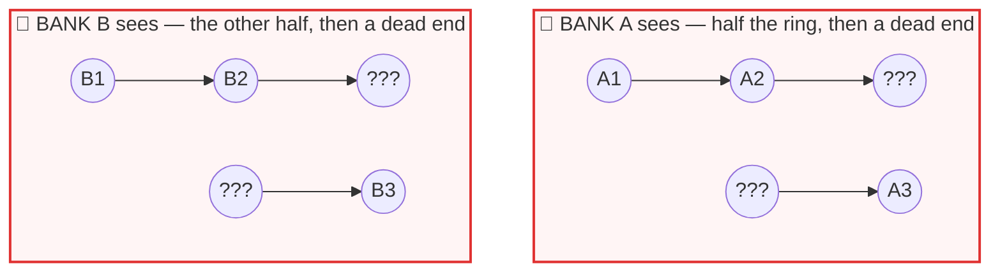
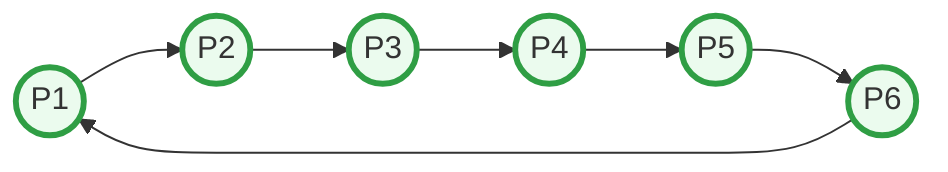
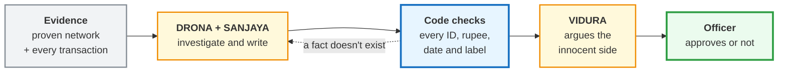
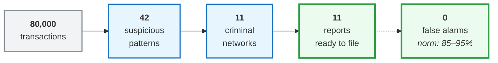

# CHAKRAVYUH · चक्रव्यूह

### We score the network, not the transaction.

**AI-powered anti-money-laundering investigation system** · IGNITRRON'26 · Problem Statement **FC-02** · Team **Tech Coders (T-300)**

[**▶ Live demo**](https://chakravyuh-bnkiuzjcv44pm79vn7jaxr.streamlit.app/) · [**▶ Demo video**](https://drive.google.com/file/d/1DcThqp_D1bDghtR9tl4Vzy596FecWCZb/view?usp=sharing) · [Technical docs](docs/TECHNICAL.md) · [Build log](docs/DEVELOPMENT_LOG.md) · [Evidence pack](docs/EVIDENCE_PACK.md)

| 11 of 12 | 0 | 246 / 246 | 11 / 11 | 0 |
|:---:|:---:|:---:|:---:|:---:|
| hidden laundering rings caught | false positives | AI facts verified against raw data | reports passed independent review | API calls needed for the demo |

| Where to look | |
|---|---|
| The problem, and who it hurts | [§1](#1--the-problem) · [§2](#2--who-it-hurts-and-how-much) |
| Why nothing on the market solves it | [§3](#3--why-todays-solutions-fail) |
| What we built | [§4](#4--our-solution) |
| What is genuinely new here | [§5](#5--what-makes-ours-different) |
| Proof it works | [§6](#6--does-it-work) |
| Could a real bank use it | [§7](#7--could-a-real-bank-use-it) |

---

## 1 · The problem

A criminal never moves dirty money in one big suspicious transfer.

They split it into **many small, boring, perfectly legal-looking transfers**, pass it through accounts that belong to other people, and bring it back clean.

Bank software checks **each transfer on its own** — so each one passes.

> **The crime is not in any transaction. The crime is the shape they make together.**
> Nobody's software looks at the shape.

**FC-02 asks for a system that finds that shape** — and that can prove what it found, to a regulator, without accusing innocent people.

---

## 2 · Who it hurts, and how much

| Who | What it costs them |
|---|---|
| **Society** | **$800bn – $2tn** laundered every year — 2–5% of global GDP. Authorities catch **under 1%** |
| **Banks** | **$206bn a year** spent trying. **85–95%** of alerts are false alarms. **$25–$50** to investigate each one |
| **Investigators** | Buried in noise. Only **1–5%** of alerts ever become a real report |
| **Innocent customers** | India has frozen roughly **8.5 lakh accounts** in the mule crackdown — the blunt approach also catches students and small traders who did nothing wrong |
| **Small banks** | India's **1,843 co-operative banks** carry the same legal duty as SBI, with none of the budget |

### It is not theoretical — TD Bank, October 2024

TD Bank failed to monitor **92% of its transaction volume — $18.3 trillion** — while three criminal networks moved **$670 million** through it. Its rules had barely changed since 2014.

**Penalty: $3.09 billion**, the largest ever under the Bank Secrecy Act.

> They were not short of alerts. They could not connect them.

### And in India, right now

The **FATF's Mutual Evaluation of India (September 2024)** rated India's *Supervision* and *Preventive Measures* only **Moderate**, and found:

> *"Suspicious transaction reporting by some FI sub-sectors appears low"* — naming **rural banks and non-banking companies**.

Too much noise for the big banks. **No tool at all for the small ones.** Innocent people paying for both.

---

## 3 · Why today's solutions fail

| What banks use now | Why it fails |
|---|---|
| **Rule engines** — "flag anything over ₹10 lakh" | Criminals simply stay under the line. Generates **85–95% false alarms**. TD Bank's rules were 10 years stale |
| **Machine-learning scoring** | Laundering is **0.1–2%** of any dataset, and the "right answers" are really analyst opinions. A regulator cannot accept *"the model felt it was suspicious"* |
| **Manual investigation** | An analyst can genuinely follow a money trail — at **hours per case**, for a handful of cases a week |
| **Pooling data across banks** (Netherlands, TMNL) | It **worked** — and was **shut down in January 2025** after a human-rights challenge on behalf of 15,000 customers. It required collecting innocent people's data in one place |
| **Generative AI writing reports** | It invents facts. Inside a legal filing, one invented number destroys the case — so a human must re-check everything, which puts back the work the tool removed |

> **The gap:** every approach either drowns the bank in noise, cannot explain itself to a regulator, stops at the bank's own wall, or cannot be trusted to write the truth.

---

## 4 · Our solution

**CHAKRAVYUH builds a map of the money, finds the shapes criminals make, and hands the officer a finished, fact-checked case instead of an alert.**



**Blue = plain computer logic. Yellow = AI. Green = a human being.**

> 🔒 **The rule behind the whole design: AI never decides. AI only explains.**

The detectors are graph mathematics — exact, repeatable, traceable. A regulator cannot accept *"the model felt it was suspicious."* They can accept *"these six transfers form a closed loop, here they are."*

**The evidence exists before the AI ever speaks.**

### The seven detectors are the regulator's own indicators

We did not invent these patterns. They are what India's regulator tells banks to watch for.

| Detector | What it hunts | The official rule it implements |
|---|---|---|
| 🔄 **CIRCLE** | Money that leaves and comes back | RBI: *"complex transactions with no apparent economic rationale"* |
| 🕸️ **SPRAY** | One account feeding 25 others, or 25 feeding one | FIU-IND: mule-account fan-out over UPI |
| ⚡ **SPEED** | Money leaving minutes after arriving | RBI: *"turnover inconsistent with the balance maintained"* |
| 📏 **THRESHOLD** | Transfers sitting just under the reporting limit | Structuring below the ₹10,00,000 PMLA limit |

Plus three more: dormant reactivation, pass-through behaviour, round-amount clustering.

**Why seven and not one:** a single signal is weak. A circle might be innocent. A circle *plus* speed *plus* amounts hugging the legal threshold is not.

### Three AI agents, named for the Mahabharata

| Agent | Role |
|---|---|
| **DRONA** | Lead investigator. Triages, chooses its own read-only evidence tools, recommends a decision |
| **SANJAYA** | Writes the case in plain English |
| **VIDURA** | Argues the innocent side before anything passes |

---

## 5 · What makes ours different

### 🥇 Novelty 1 — We work out who people really are *before* looking for crime

Everyone else builds the map from account numbers. But the same person sits in a bank's records three or four times, spelled differently, with pieces missing:

```
 SYSTEM               NAME ON RECORD    PHONE         PAN           ACCOUNT
 ───────────────────────────────────────────────────────────────────────────
 CORPORATE BANKING    ANNA DESAI        7705029423    FNZVH4843G    ACC00003
 RETAIL BANKING       Anna Deasi   ←    7705029423    FNZVH4843G    ACC00004
 WATCHLIST            Anna Deasi   ←    7705029423    FNZVH4843G    ACC00003
                          ↑
                    spelled wrong
```

Until those records are joined, **the map is wrong** — and the circle between them is invisible.



**Six strangers become one closed circle.** In our data, 47 ring accounts belong to only **19 real people**.

And it is **precision-first** — we would rather miss a link than accuse an innocent person. Blocking rules beat matching rules: two different PANs can never be one person; a shared address with different PANs is a family, not an individual.

> **Better because:** every other system searches a map that is already wrong. **2,500 accounts → 1,828 people, zero false merges.**

---

### 🥇 Novelty 2 — Two banks catch a shared gang without sharing any customer data

This is the failure that killed the Dutch consortium. We solved it by never pooling data at all.



Anyone at the other bank is an unreadable **???**, and a bank cannot even tell that two of those unknowns are the same person. One hop happens entirely inside each bank, so **neither can ever close the loop alone.**

Now the same six accounts through the consortium — **scrambled codes only.** The loop closes:



| ✅ What crosses | ❌ What never crosses |
|---|---|
| A one-way scrambled code made from the PAN | Names · readable PANs · addresses |
| Direction of money, in or out | Balances · KYC documents |
| A rough amount band and time band | Account numbers |

The same person at two banks produces the same code — and **neither bank can turn that code back into a name.**

> **Better because:** the only approach that ever solved cross-bank laundering was made illegal for collecting innocent people's data. **Ours gets the same answer with nothing to collect.** Bank A alone: ❌ · Bank B alone: ❌ · Consortium: ✅

---

### 🥇 Novelty 3 — The AI is not trusted. It is checked by arithmetic.

Everyone building AI for compliance faces one objection: *what if it invents something, inside a legal document?* The usual answer — "a human reviews it" — puts back the work the tool was meant to remove.



**Step 3 is not an AI checking an AI. It is code checking arithmetic.**

This caught real mistakes during our build. The AI wrote **₹140 crore** where the true figure was **₹14 crore**. It labelled a mule case as *"structured transactions."* Both were blocked before any human saw them.

Then we fixed the cause: **the AI is no longer allowed to write numbers at all.** Code formats every amount into finished text and the AI may only copy it.

VIDURA also judges by the **correct legal standard** — *reasonable suspicion*, not proof of guilt. A compliance officer never has proof of criminal intent when they file; demanding it would block every genuine report.

> **Better because:** nobody else can say the AI's output was checked without a human. **246 of 246 facts verified, 11 of 11 cases passed.**

---

## 6 · Does it work?



| Stage | Result |
|---|---|
| **Identity** | 2,500 accounts → 1,828 people, **zero false merges** |
| **Detection** | 42 findings → 11 cases · **11 of 12 hidden rings** · **0 false positives** |
| **Cross-bank** | Hero ring — ₹2.4 crore, 6 accounts, 3 hours — invisible to each bank alone, **visible in the consortium** |
| **Relationships** | **2.73** unusual-relationship signals per case vs **0.4** for random customer groups |
| **AI investigation** | **11/11 PASS** · **246/246 facts verified** · 9 HIGH, 2 MEDIUM confidence |

**About the one we missed:** we did not find `CIRC_5_SUBTLE`, the ring we deliberately made hardest. **We are reporting 11 of 12 rather than tuning our settings until we reached 12.** A system that scores perfectly on data it generated itself is not one a bank should trust — and **zero false alarms matters more than a perfect catch rate**, because every false alarm in the real world is an innocent person locked out of their own money.

---

## 7 · Could a real bank use it?

### Built against India's actual rules

| What the law requires | How CHAKRAVYUH meets it |
|---|---|
| RBI: *"deploy robust software that throws up alerts"* | Seven detectors plus lowered-threshold monitoring of known risk |
| RBI: risk-based monitoring | Two lanes — normal thresholds for everyone, lowered for known high-risk |
| PMLA: file an STR **within 7 working days** | A drafted, evidence-linked case in **under a minute** |
| PMLA: *"unusual or unjustified complexity"*, *"no economic rationale"* | The exact wording the system writes — the legal test, applied |
| Reports must be evidence-backed and traceable | Every arrow keeps its transaction IDs |
| A named officer is accountable | **Nothing is filed without a human pressing approve** |
| Must withstand a regulator's audit | Detection is deterministic — every finding reproducible |
| Limits on sharing customer data | The consortium exchanges scrambled codes only |

### Who would buy it

A transaction monitoring platform costs **$100,000–$500,000 a year** before anyone is hired to run it. India's **1,843 co-operative banks** will never pay that — which is exactly why the FATF found their reporting low.

**CHAKRAVYUH runs on a laptop.** No training data, no labelled examples, no GPU. The live demo makes **zero API calls** because results are computed once and cached.

### What production would actually need

Honest answer: **data integration and scale testing, not a different approach.** A bank points it at its core banking export and KYC records — the same CSV shapes we already consume. The detection, case builder and agents are unchanged. The work left is connectors, throughput, and a supervised tuning period against that bank's own history.

---

## 8 · Run it

```bash
git clone https://github.com/akarshncodes/chakravyuh.git && cd chakravyuh
pip install -r requirements.txt
streamlit run app.py        # uses committed results — no API key needed
```

**Try this in the app:** Dashboard → **Case File** *(rotatable 3D money trail)* → **AI War Room** → **C001** → **▶ Replay investigation** → **Cross-Bank View** → Bank A / Bank B / Consortium → **Case Queue** → **Approve** → download the STR report.

| File | What it does |
|---|---|
| `generate_data.py` | 1 · Synthetic bank data, 12 hidden rings (seed 26192) |
| `entity_resolution.py` | 2 · Scattered records → real people, precision first |
| `graph_builder.py` | 3 · Money graph in 4 views |
| `detectors.py` | 4 · Seven deterministic detectors |
| `case_builder.py` · `relationships.py` | 5 · Findings → cases, plus the Relationship Lens |
| `orchestrator.py` | DRONA — AI lead investigator with read-only tools |
| `agents.py` | 6–7 · SANJAYA (writer) and VIDURA (fact-check + sceptic) |
| `app.py` · `str_report.py` | 8 · Dashboard and printable STR draft |

Each stage reads the previous stage's files and writes its own, so any stage can be re-run and checked alone.

**Stack:** Python · NetworkX · pandas · Streamlit · Plotly · OpenAI API · Streamlit Community Cloud

---

## Limits we own

We would rather tell you than have you find it.

| Limitation | Honest detail |
|---|---|
| One ring undetected | `CIRC_5_SUBTLE`, deliberately the hardest. Not tuned around |
| Lane labelling | Cases are tagged by *who* appears in them rather than *which threshold* found them. The detection is right; the label is not |
| Hero ring joins to 4 people, not 3 | Two records share only a name. The matcher correctly refused — precision held, a link was lost |
| Synthetic data | Unavoidable at a hackathon. Going live needs integration and scale testing |
| Two banks | The consortium design extends to any number; we demonstrate two |

---

## Team Tech Coders (T-300)

| | Role |
|---|---|
| **Akarsh N** *(lead)* | Problem research, system architecture, AI agent design, product and pitch |
| **Rohit S** | Testing and verification, domain research, demo and presentation |

---

## Sources

Every figure above can be checked.

- [FATF — Mutual Evaluation of India, September 2024](https://www.fatf-gafi.org/en/publications/Mutualevaluations/India-MER-2024.html)
- [FIU-IND — STR and CTR reporting obligations](https://fiuindia.gov.in/files/FAQs/faqs.html)
- [RBI — Master Circular on KYC norms and AML standards](https://rbidocs.rbi.org.in/rdocs/content/pdfs/45ML010712F_A.pdf)
- [US DOJ — TD Bank guilty plea, October 2024](https://www.justice.gov/archives/opa/pr/td-bank-pleads-guilty-bank-secrecy-act-and-money-laundering-conspiracy-violations-18b)
- [Transaction Monitoring Netherlands — what went wrong](https://zquas.ai/tmnl.html)
- [PIB — Cooperative Banks in India, August 2025](https://www.pib.gov.in/PressReleasePage.aspx?PRID=2157875&reg=3&lang=2)
- [AML compliance costs for mid-size banks, 2026](https://fraxtional.co/feeds/blog/aml-compliance-systems-cost-mid-size-banks)
- [Money laundering statistics 2026 — KYC Hub](https://www.kychub.com/blog/money-laundering-statistics)

---

*Synthetic data only. Prototype, not an official bank or government system. Nothing is ever filed automatically.*

**We score networks, not transactions.**
