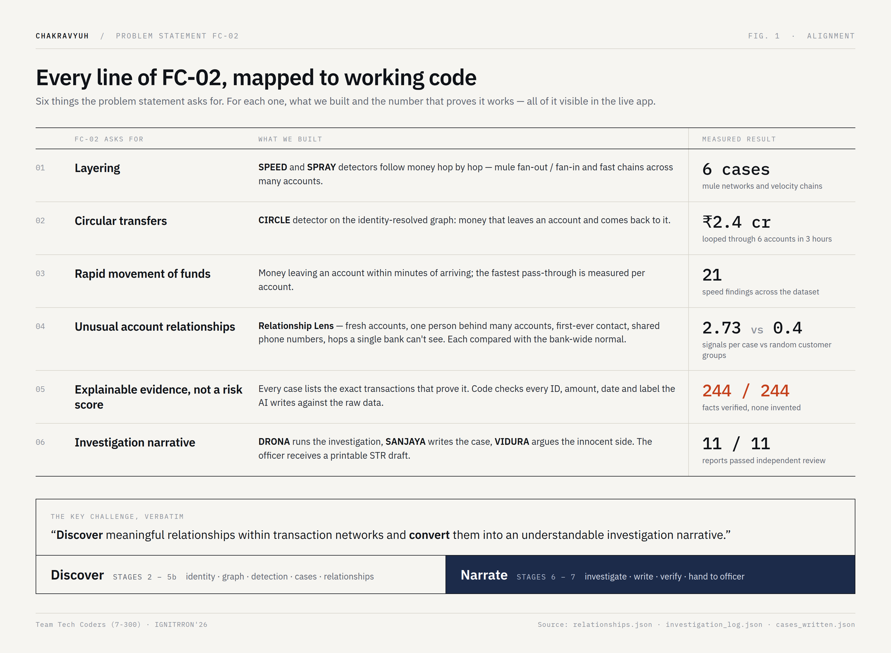
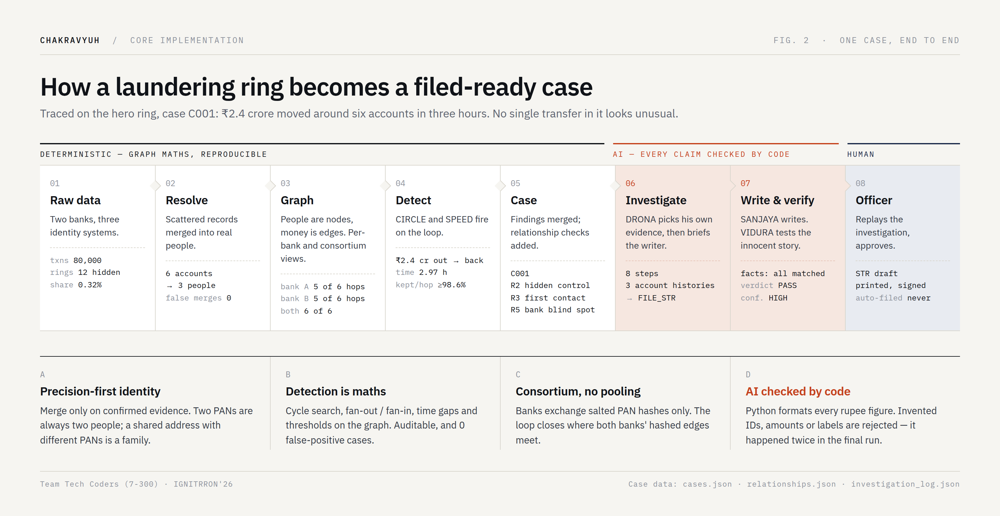
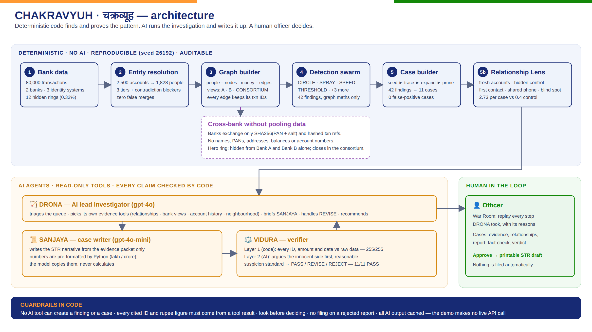
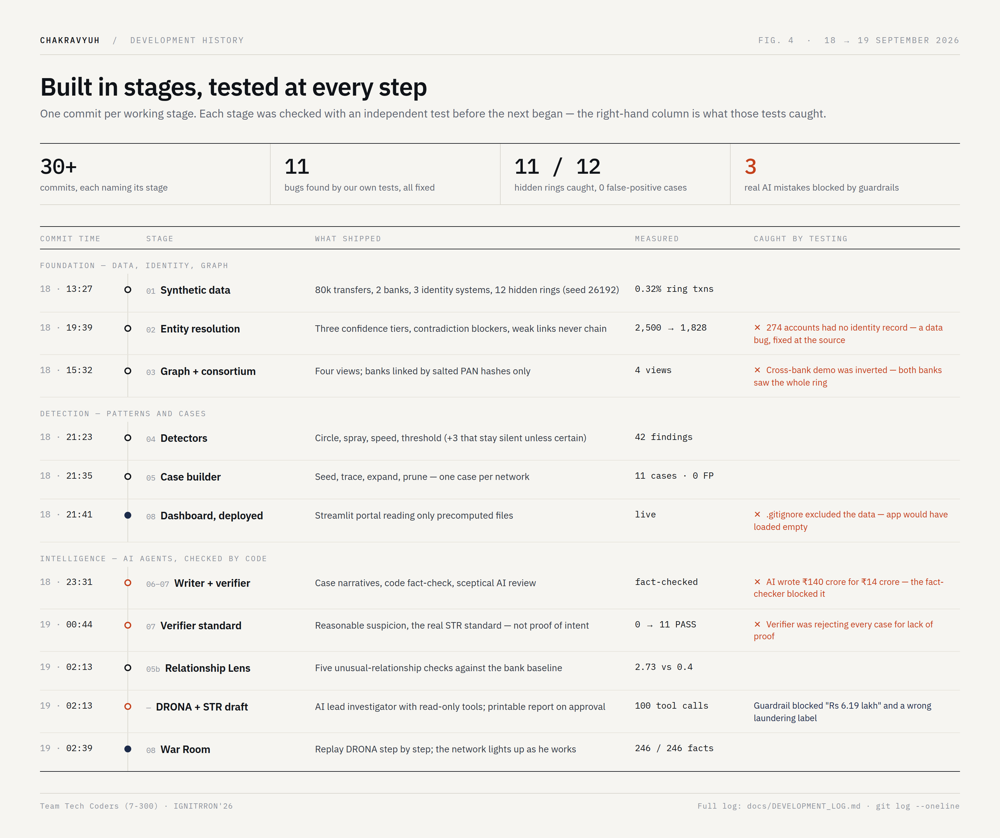

# CHAKRAVYUH · चक्रव्यूह

**AI-powered anti-money-laundering investigation system** · IGNITRRON'26 · Problem Statement **FC-02** · Team **Tech Coders (7-300)**

**[▶ Live demo](https://chakravyuh-bnkiuzjcv44pm79vn7jaxr.streamlit.app/)** · [Full technical docs](docs/TECHNICAL.md) · [Development log](docs/DEVELOPMENT_LOG.md)

> Banks check one transaction at a time, so a laundering ring made of normal-looking transfers stays invisible.
> **CHAKRAVYUH scores the network, not the transaction, and hands the officer a finished, fact-checked case instead of an alert.**

| 11 of 12 | 0 | 246 / 246 | 11 / 11 | 0 |
| :---: | :---: | :---: | :---: | :---: |
| hidden laundering rings caught | false-positive cases | AI-written facts verified against raw data | reports passed independent review | live API calls needed for the demo |

---

## 60-second guide for judges

| Criterion | In one line | Look here |
| --- | --- | --- |
| **Problem Statement Alignment** | Every FC-02 ask (layering, circles, rapid movement, unusual relationships, evidence, narrative) maps to a feature and a number | [§1](#1-problem-statement-alignment) |
| **Core Implementation** | Deterministic graph detection finds and proves the pattern; 3 AI agents investigate and write; code checks the AI | [§2](#2-core-implementation) |
| **Code / Architecture** | 8 stages, one Python file each, clean hand-offs through files; AI isolated behind read-only tools | [§3](#3-code--architecture) |
| **Meaningful Development Progress** | From raw data to a working, deployed investigator in 24 hours, with measured results at each stage | [§4](#4-meaningful-development-progress) |
| **Development History** | 30+ commits, one per working stage; 11 bugs found by testing and fixed | [§5](#5-development-history) |
| **README / Documentation** | This page, plus full technical docs and a build log; runs in 3 commands | [§6](#6-documentation--how-to-run) |

---

## 1. Problem Statement Alignment

FC-02's key challenge: *"discover meaningful relationships within transaction networks and convert them into an understandable investigation narrative."* We used that sentence as our architecture: stages 2–5b **discover**, stages 6–7 **narrate**.



We don't output a risk score. Each case has a *queue priority*, but that only sets the order an officer works in. The output is the evidence plus the written case.

## 2. Core Implementation



- **Detection is maths, not AI.** Cycle search, fan-out/fan-in, time gaps and threshold rules on the graph. It's reproducible, auditable and gives 0 false-positive cases.
- **Three AI agents.** **DRONA** (gpt-4o) runs the investigation. He triages, picks his own evidence tools, briefs the writer, and recommends a decision (13 items, 100 tool calls he chose; 11 FILE STR · 2 MONITOR). **SANJAYA** writes the case. **VIDURA** argues the innocent side before passing it.
- **The AI is checked by code, not trusted.** Every ID, rupee figure, date and laundering label the AI writes must match the raw data or it's rejected. In real runs this blocked a wrong figure ("Rs 6.19 lakh") and a wrong label ("structured transactions" on a mule case).

## 3. Code / Architecture



| File | What it does |
| --- | --- |
| `generate_data.py` | **1** · Synthetic bank data with 12 hidden rings (seed 26192) |
| `entity_resolution.py` | **2** · Scattered identity records → real people (precision first) |
| `graph_builder.py` | **3** · Money graph in 4 views: all, Bank A, Bank B, consortium |
| `detectors.py` | **4** · Deterministic detectors: circle, spray, speed, threshold (+3) |
| `case_builder.py` | **5** · Findings → one case per network |
| `relationships.py` | **5b** · Relationship Lens: unusual account relationships vs bank baseline |
| `orchestrator.py` | **DRONA** · AI lead investigator with read-only tools and code guardrails |
| `agents.py` | **6–7** · SANJAYA (writer) and VIDURA (fact-check + sceptical review) |
| `app.py` · `str_report.py` | **8** · Dashboard (War Room, cases, scorecard) and printable STR draft |
| `*.csv` · `*.json` · `graphs/` | Generated data and cached results, committed so the live app needs no compute |
| `docs/` | Diagrams, [technical docs](docs/TECHNICAL.md), [development log](docs/DEVELOPMENT_LOG.md) |

Each stage reads the previous stage's files and writes its own, so any stage can be re-run and checked on its own.

## 4. Meaningful Development Progress



| Stage | Result |
| --- | --- |
| Identity | 2,500 accounts → 1,828 people, zero false merges |
| Detection → cases | 42 findings → 11 cases · 11 of 12 rings · 0 false positives |
| Cross-bank | Hero ring (₹2.4 crore, 6 accounts, 3 hours) invisible to each bank alone, visible in the consortium |
| Relationships | 2.73 unusual-relationship signals per case vs 0.4 for random customer groups |
| AI investigation | 11/11 PASS · 246/246 facts verified · confidence 9 HIGH, 2 MEDIUM |

## 5. Development History

- **30+ commits**, one per working stage or fix. The messages name the stage: `git log --oneline`.
- **11 bugs found by our own testing, all fixed.** For example, the cross-bank demo was inverted, the AI wrote ₹140 crore for ₹14 crore, and the verifier demanded proof of intent.
- Full story, with what each test caught: **[docs/DEVELOPMENT_LOG.md](docs/DEVELOPMENT_LOG.md)**

## 6. Documentation & how to run

```bash
git clone https://github.com/akarshncodes/chakravyuh.git && cd chakravyuh
pip install -r requirements.txt
streamlit run app.py        # uses the committed results, so no API key is needed
```

**Try this in the app:** **Dashboard** (the whole picture) → **Case File** (main suspect, where the money came from and went, rotatable 3D money trail) → **AI War Room** → pick **C001** → **▶ Replay investigation** → **Cross-Bank View** → Bank A / Bank B / Consortium → **Case Queue** → C001 → **Approve** → download the **STR report**.

Rebuilding every stage from scratch, the design decisions and the limitations are all in **[docs/TECHNICAL.md](docs/TECHNICAL.md)**.

**Stack:** Python · NetworkX · pandas · Streamlit · Plotly · OpenAI API (gpt-4o, gpt-4o-mini) · Streamlit Community Cloud

---

## Team Tech Coders (7-300)

| | Role |
| --- | --- |
| **Akarsh N** (team lead) | Problem selection and research, system architecture, AI agent design, product and pitch |
| **Rohit S** | Testing and verification, domain research, demo and presentation |

*Synthetic data only. Prototype, not an official bank or government system. Nothing is ever filed automatically.*
